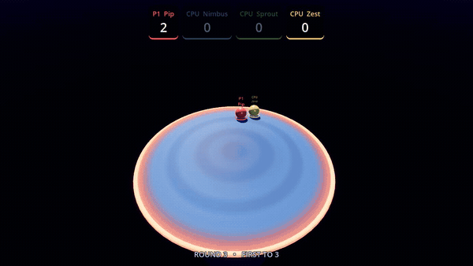
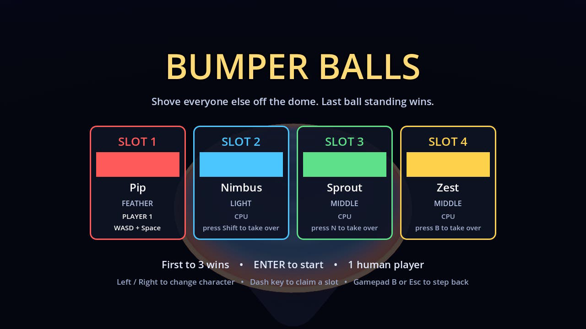
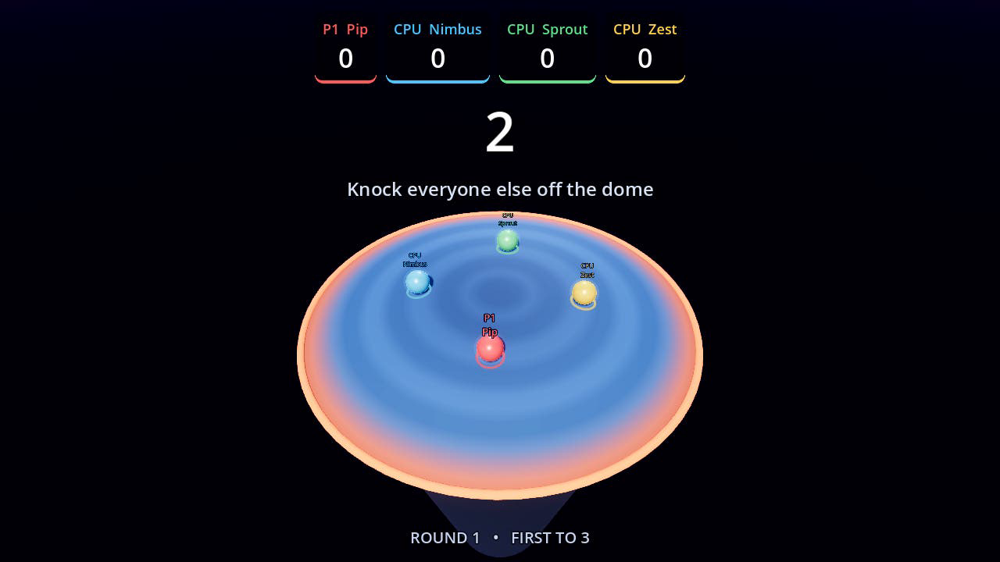
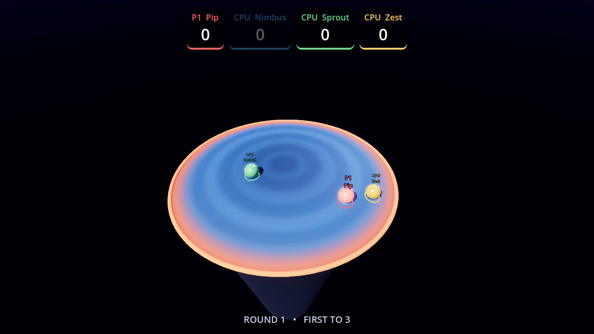
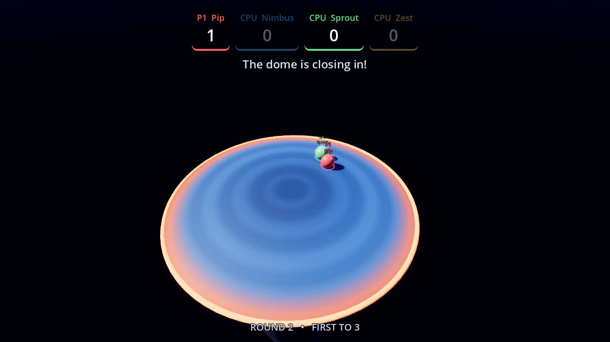
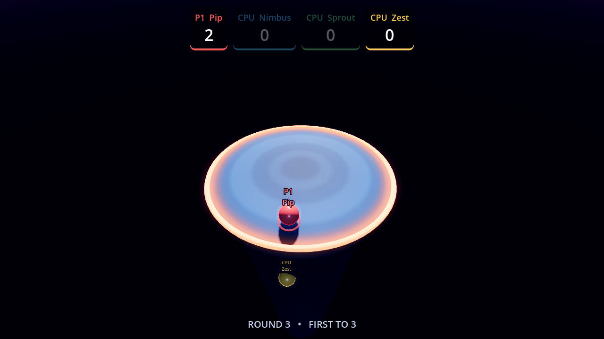
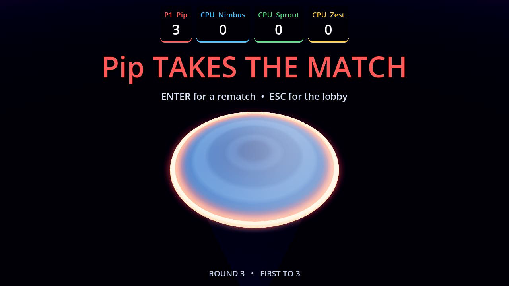

# Bumper Balls

A local-multiplayer sumo brawler for **Godot 4.3**, built after Mario Party's
*Bumper Balls*. Up to four balls share a domed platform floating over nothing in
particular. There is no health and no attack button worth the name — you win by
making everyone else leave.



*Round 3, deep into the squeeze: the dome has closed in, Pip knocks the last CPU
off and takes the match.*

## Demo

| | |
|---|---|
|  |  |
| Character select — claim a slot from the CPU | Countdown, everyone pinned in place |
|  |  |
| Opening scrum | The rim starts closing in |
|  |  |
| Last ball on a much smaller dome | Match over |

Video clips (lobby to first round, a full round with the shrink, and the
endgame) are produced by the capture rig below rather than committed, to keep
binaries out of the repo:

```sh
godot --path . res://tools/capture.tscn --write-movie take.avi --fixed-fps 30 \
  --resolution 1280x720 -- --drive --start-delay=4 --quit-after=85
```

## Rules

- Last ball on the dome wins the round. First to **3** round wins takes the match.
- The dome has no flat spot. Stop steering and you will drift outward.
- After 7 seconds the rim starts closing in, and it accelerates the longer the
  round drags on. Stalling is not a strategy.
- Cross the rim and nothing holds you up any more. You can still be hit on the
  way down, and you can still hit someone.

## Controls

| Slot | Move | Dash / claim slot |
|------|------|-------------------|
| 1 | `W` `A` `S` `D` | `Space` |
| 2 | Arrow keys | `Shift` |
| 3 | `I` `J` `K` `L` | `N` |
| 4 | `T` `F` `G` `H` | `B` |

Gamepads work too: **slot N uses joypad device N-1**, left stick or d-pad to
move, A to dash, B to step back, Start to begin.

In the lobby, press a slot's dash key to take it over from the CPU, `Left`/`Right`
to change character, and `Enter` to start. `Esc` returns to the lobby mid-match;
`R` restarts the match.

**Dash** is a short burst on a cooldown. During the burst your bumps hit roughly
twice as hard, which is how most knockouts actually happen. Dashing in mid-air
still works but at under half strength — enough to claw back from the rim
occasionally, not enough to make falling off harmless.

## Characters

Mass is the only thing that decides who wins a collision. Everything else is a
counterweight to it: lighter balls accelerate harder, move faster and dash more
often.

| | Class | Mass | Accel | Top speed | Dash cooldown |
|---|---|---|---|---|---|
| Pip | Feather | 0.78 | 48 | 13.0 | 0.85 s |
| Nimbus | Light | 0.90 | 43 | 12.0 | 0.92 s |
| Sprout | Middle | 1.00 | 38 | 11.0 | 1.00 s |
| Zest | Middle | 1.10 | 35 | 10.5 | 1.06 s |
| Mauve | Heavy | 1.26 | 31 | 9.6 | 1.18 s |
| Rook | Boulder | 1.45 | 27 | 8.8 | 1.30 s |

Over a 23-round CPU-vs-CPU soak with Pip, Sprout, Mauve and Rook the win split
was 4 / 7 / 7 / 5 — the extremes land within noise of each other.

## Running it

Open the folder in Godot 4.3 and press play, or:

```sh
godot --path .
```

There is an attract / smoke-test mode that boots straight into an all-CPU match:

```sh
godot --path . -- --cpu-demo                  # loops matches forever
godot --headless --path . -- --cpu-demo --quit-after=120
```

Headless runs print one line per round (`[demo] round 3  16.2s  rim 9.4  winner
slot 1`), which is how the physics and balance above were tuned. Headless also
spams `Parameter "m" is null` from the dummy renderer whenever a mesh is built —
that is an artifact of having no GPU, not a problem with the project.

## Development tools

`tools/capture.tscn` wraps the game scene with a rig that drives slot 1 with
**synthetic keyboard events** — real `InputEventKey`s pushed through
`Input.parse_input_event`, so it exercises the actual InputMap and the same
`BumperBall` code path a person would, rather than poking the ball directly. It
presses Enter on the lobby, plays a round, and can grab screenshots on a
schedule.

```sh
# Verify every slot's bindings resolve and respond
godot --headless --path . res://tools/capture.tscn -- --input-test

# Play a match on its own and grab stills
godot --path . res://tools/capture.tscn -- --drive --shot=/tmp/a.png:12 --quit-after=30
```

`--input-test` is how the hand-written InputMap in `project.godot` was checked;
all four keyboard layouts and all 31 actions resolve.

## How it fits together

```
scripts/
  game_config.gd   autoload: roster, slot assignment, scores
  sfx.gd           autoload: pooled one-shot audio
  main.gd          match flow (lobby -> countdown -> round -> scoring)
  arena.gd         the dome: generated mesh, collision, shrink
  ball.gd          one ball: steering, dash, bump impulses, falling off
  ai_brain.gd      CPU driver
  camera_rig.gd    orbiting chase camera
  hud.gd           score bar, announcements, lobby
audio/             sound effects, generated by tools/make_sfx.py
```

### The dome

The arena is a cap cut from a large sphere (radius 48) whose apex sits at the
origin. Collision is the *whole* sphere — smooth, exact and free — while the
visible cap is rebuilt whenever the play radius shrinks. A ball that rolls past
the rim simply drops the arena bit from its collision mask, so it falls without
any special-cased geometry.

The sphere is deliberately much larger than the platform. Rolling on a sphere cap
is exponentially unstable: with a tighter dome an unattended ball reaches the rim
in about two seconds, which makes the game unplayable rather than tense. Radius 48
plus a linear damp of 1.1 gives a steady outward pressure you can comfortably
fight, and leaves the danger where it belongs — in the shrinking rim and in other
players.

### Bumps

Godot's rigid-body solver already transfers momentum by mass, so the extra arcade
impulse in `ball.gd` scales by the *square root* of the mass ratio. Applying the
full ratio a second time made heavyweights unbeatable; the square root leaves
weight meaningful without making it decisive.

Only the closing component of the relative velocity counts toward a bump, so
glancing contact barely registers while a head-on charge sends someone a long way.
Knockback deliberately ignores the top-speed limit — a good hit should always
carry further than anyone can drive themselves.

## Assets

No binary assets are vendored beyond the screenshots in `docs/`.
`tools/make_sfx.py` synthesises every sound effect with the Python standard
library; re-run it to regenerate `audio/`.
