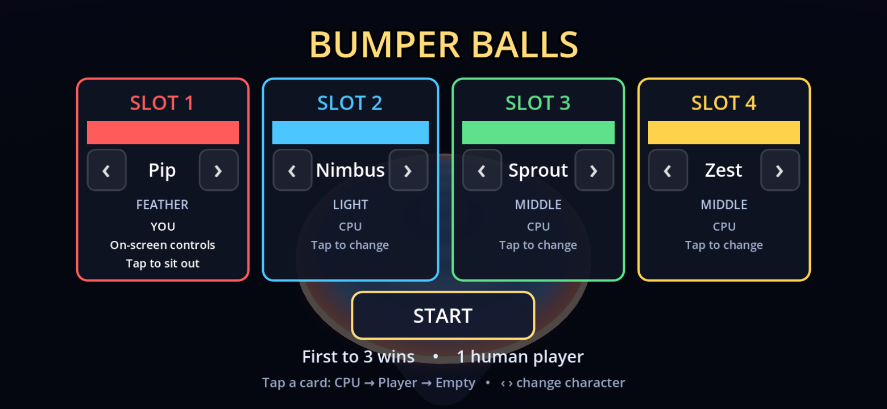
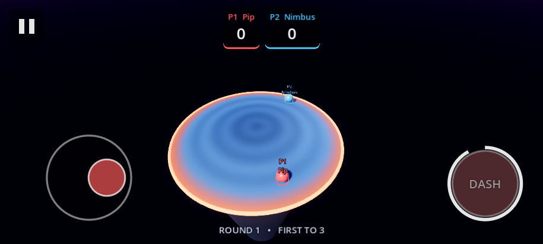
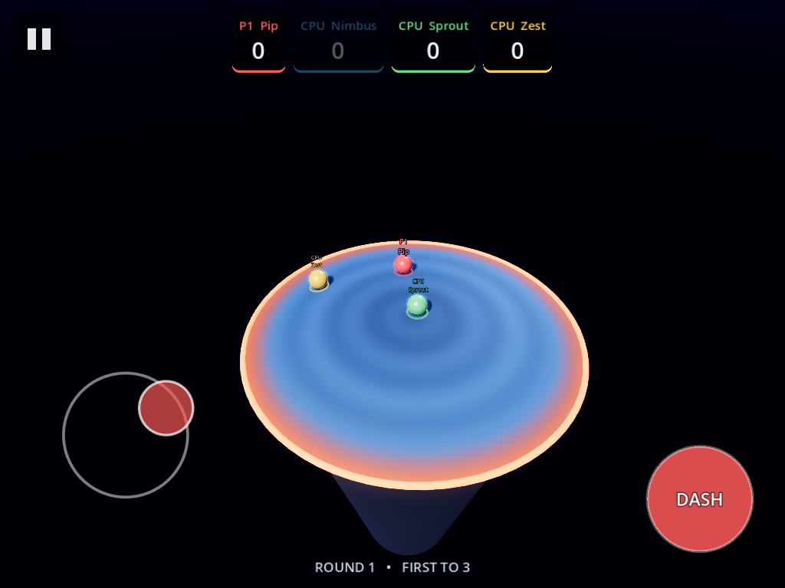
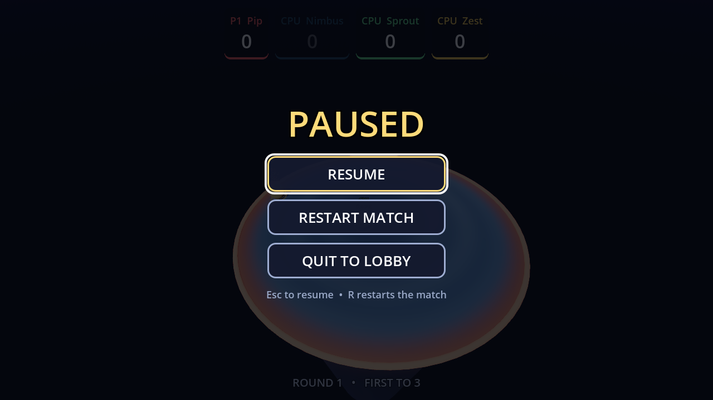

# Bumper Balls

A sumo brawler for **Godot 4.3**, built after Mario Party's *Bumper Balls*. Up
to four balls share a domed platform floating over nothing in particular. There
is no health and no attack button worth the name — you win by making everyone
else leave.

Plays on desktop with keyboards and gamepads (up to four players on one screen),
and on phones and tablets with touch — natively on Android and iOS, or in a
mobile browser.


*Round 3, deep into the squeeze: the dome has closed in, Pip knocks the last CPU
off and takes the match.*

## Demo

| | |
|---|---|
|  |  |
| Character select — claim a slot from the CPU | Countdown, everyone pinned in place |
|  |  |
| Opening scrum | The rim starts closing in |
|  |  |
| Last ball on a much smaller dome | Match over |

Video clips (lobby to first round, a full round with the shrink, and the
endgame) are produced by the capture rig below rather than committed, to keep
binaries out of the repo:

```sh
godot --path . res://tools/capture.tscn --write-movie take.avi --fixed-fps 30 \
  --resolution 1280x720 -- --drive --start-delay=4 --quit-after=85
```

## On phones and tablets

| | |
|---|---|
|  |  |
| Phone lobby: tap a card to change who plays, ‹ › to pick a character | The web build in a phone browser, two fingers down: stick held, DASH cooling down |
|  |  |
| 4:3 tablet: the camera keeps the arena clear of your thumbs | Desktop pause menu, navigable by keyboard or pad |

- **Floating stick** on the left half of the screen — it appears wherever your
  thumb lands. **DASH** on the right, with a ring that sweeps round while it
  recharges. **Pause** in the top-left corner. Multi-touch, so you can dash
  without letting go of the stick.
- The on-screen stick drives slot 1 (strictly, the first slot set to Player).
  Other slots can be CPUs, empty, or players on paired gamepads.
- The UI is drawn larger on handhelds (1.35× on phones, 1.1× on tablets) so text
  stays readable and every button is a comfortable tap target, and it keeps out
  of notches and the home indicator.
- On a 4:3 tablet the dome would otherwise fill the width and sit under your
  thumbs; the camera pulls back just enough to frame it between the controls.
- Native builds lock to landscape. A browser can't, so holding a phone upright
  shows a "turn your phone sideways" prompt and pauses any match in progress.
- Switching apps or taking a call pauses the game. Android's back button pauses,
  resumes, and backs out of menus.
- Your phone buzzes when you're hit and when you're knocked out; gamepad players
  get rumble on their own pad.

**The whole UI follows whatever you last touched.** Press a key and hints name
keys; press a pad button and they name pad buttons; tap the screen and the
on-screen controls appear and the hints turn into "tap" wording. So a
touchscreen laptop, a tablet with a pad paired, or a phone with a keyboard all
behave sensibly — nothing depends on guessing the platform.

## Rules

- Last ball on the dome wins the round. First to **3** round wins takes the match.
- The dome has no flat spot. Stop steering and you will drift outward.
- After 7 seconds the rim starts closing in, and it accelerates the longer the
  round drags on. Stalling is not a strategy.
- Cross the rim and nothing holds you up any more. You can still be hit on the
  way down, and you can still hit someone.

## Controls

| Slot | Move | Dash / claim slot |
|------|------|-------------------|
| 1 | `W` `A` `S` `D` | `Space` |
| 2 | Arrow keys | `Shift` |
| 3 | `I` `J` `K` `L` | `N` |
| 4 | `T` `F` `G` `H` | `B` |

Gamepads work too: **slot N uses joypad device N-1**, left stick or d-pad to
move, A to dash, Start to begin or pause.

In the lobby, a slot's dash key cycles it through **CPU → Player → Empty**
(gamepad B steps back the other way), `Left`/`Right` changes character, and
`Enter` starts. Cards and buttons are clickable too. A slot never empties if
that would leave fewer than two balls.

Mid-match, `Esc`, `P` or a pad's Start opens the **pause menu** (Resume, Restart
match, Quit to lobby — navigable with arrows or d-pad and A). `R` restarts the
match directly. Nothing quits a match in one press any more: pad B used to throw
the match away mid-round, and now does nothing during play.

**Dash** is a short burst on a cooldown. During the burst your bumps hit roughly
twice as hard, which is how most knockouts actually happen. Dashing in mid-air
still works but at under half strength — enough to claw back from the rim
occasionally, not enough to make falling off harmless.

## Characters

Mass is the only thing that decides who wins a collision. Everything else is a
counterweight to it: lighter balls accelerate harder, move faster and dash more
often.

| | Class | Mass | Accel | Top speed | Dash cooldown |
|---|---|---|---|---|---|
| Pip | Feather | 0.78 | 48 | 13.0 | 0.85 s |
| Nimbus | Light | 0.90 | 43 | 12.0 | 0.92 s |
| Sprout | Middle | 1.00 | 38 | 11.0 | 1.00 s |
| Zest | Middle | 1.10 | 35 | 10.5 | 1.06 s |
| Mauve | Heavy | 1.26 | 31 | 9.6 | 1.18 s |
| Rook | Boulder | 1.45 | 27 | 8.8 | 1.30 s |

Over a 23-round CPU-vs-CPU soak with Pip, Sprout, Mauve and Rook the win split
was 4 / 7 / 7 / 5 — the extremes land within noise of each other.

## Running it

Open the folder in Godot 4.3 and press play, or:

```sh
godot --path .
```

There is an attract / smoke-test mode that boots straight into an all-CPU match:

```sh
godot --path . -- --cpu-demo                  # loops matches forever
godot --headless --path . -- --cpu-demo --quit-after=120
```

CPU randomness is seeded from system entropy, so no two runs play out the same.
Pass `--ai-seed=N` for a reproducible run when tuning or bug-hunting.

To try the phone or tablet layout on a desktop, add `-- --phone` or
`-- --tablet` (or `-- --touch` for touch mode alone) and use a phone-shaped
window, e.g. `--resolution 1560x720`. Touch input then needs a touchscreen, or
the test harness below.

Headless runs print one line per round (`[demo] round 3  16.2s  rim 9.4  winner
slot 1`), which is how the physics and balance above were tuned. Headless also
spams `Parameter "m" is null` from the dummy renderer whenever a mesh is built —
that is an artifact of having no GPU, not a problem with the project.

## Exporting for mobile

`export_presets.cfg` has three presets. All of them leave `tools/` out of the
package.

- **Web** — `godot --headless --path . --export-release Web build/web/index.html`.
  Built without threads, so it runs from any static host (itch.io, GitHub Pages)
  with no special server headers, and in mobile browsers. This is the path that
  has been exercised end to end, in Chromium emulating an Android phone.
- **Android** — needs the Android export templates, the Android SDK and a
  keystore configured in the editor. Change `package/unique_name` from the
  placeholder `com.example.bumperballs` before publishing. Vibration permission
  is on for haptics.
- **iOS** — needs the iOS templates, a Mac with Xcode, and your Apple team ID.
  Same placeholder bundle identifier to change.

The Android and iOS presets parse and fail only on the missing templates/SDK in
the environment this was built in; neither has been built or run on a device.

The project uses Godot's **Compatibility** renderer everywhere. The web requires
it, and it runs on the widest range of phones — and rendering the desktop in
Forward+ turned out to wash the dome out to a pale grey (strong sky ambient,
fogged sky), so every platform would otherwise look like a different game.

## Development tools

`tools/capture.tscn` wraps the game scene with a rig that drives slot 1 with
**synthetic keyboard events** — real `InputEventKey`s pushed through
`Input.parse_input_event`, so it exercises the actual InputMap and the same
`BumperBall` code path a person would, rather than poking the ball directly. It
presses Enter on the lobby, plays a round, and can grab screenshots on a
schedule.

```sh
# Verify every slot's bindings resolve and respond
godot --headless --path . res://tools/capture.tscn -- --input-test

# Play a match on its own and grab stills
godot --path . res://tools/capture.tscn -- --drive --shot=/tmp/a.png:12 --quit-after=30
```

`--input-test` is how the hand-written InputMap in `project.godot` was checked;
all four keyboard layouts and all 31 actions resolve.

Three regression suites drive the real game with synthetic input and exit
non-zero on failure:

```sh
# Touch, at a phone layout: taps, the stick, two-finger dash, pause, Android back
xvfb-run godot --path . res://tools/touch_test.tscn --resolution 1600x740 -- --phone

# Keyboard and gamepad: pausing, menu navigation by d-pad and A, results screen
xvfb-run godot --path . res://tools/desktop_test.tscn --resolution 1280x720

# The Web export in Chromium, as an Android phone (real browser touch events,
# two fingers at once) and as a desktop. Needs Playwright and Pillow.
godot --headless --path . --export-debug Web build/web/index.html
(cd build/web && python3 -m http.server 8060) &
node tools/web_test.mjs /tmp/web-shots
```

`tools/ui_shots.tscn` stages every screen (lobby, play, pause, results) and
screenshots it, for checking layout across form factors without playing a
match to each one.

## How it fits together

```
scripts/
  game_config.gd   autoload: roster, slot assignment, scores
  controls.gd      autoload: active input (keys/pad/touch), form factor, UI scale
  sfx.gd           autoload: pooled one-shot audio
  main.gd          match flow (lobby -> countdown -> round -> scoring)
  arena.gd         the dome: collision, shrink (shape in shaders/dome.gdshader)
  ball.gd          one ball: steering, dash, bump impulses, falling off
  ai_brain.gd      CPU driver
  camera_rig.gd    orbiting chase camera
  hud.gd           score bar, announcements, lobby, results, pause menu
  touch_controls.gd  on-screen stick, dash and pause buttons
audio/             sound effects, generated by tools/make_sfx.py
```

### The dome

The arena is a cap cut from a large sphere (radius 48) whose apex sits at the
origin. Collision is the *whole* sphere — smooth, exact and free. A ball that
rolls past the rim simply drops the arena bit from its collision mask, so it
falls without any special-cased geometry.

Nothing is rebuilt as the rim closes in. The visible cap is modelled once at full
size, and `shaders/dome.gdshader` pulls every vertex past the live rim back onto
it and drops it onto the sphere at that radius; the colour banding and orange
danger band are computed per pixel from the same radius. The skirt is a unit
ring that gets scaled, and the rim and pillar are engine primitives. Regenerating
the mesh in GDScript used to cost ~9.7 ms (21 ms worst case), several times a
second during the squeeze; the same step is now ~0.35 ms, cheap enough to
follow the rim every frame — which a phone needs.

The sphere is deliberately much larger than the platform. Rolling on a sphere cap
is exponentially unstable: with a tighter dome an unattended ball reaches the rim
in about two seconds, which makes the game unplayable rather than tense. Radius 48
plus a linear damp of 1.1 gives a steady outward pressure you can comfortably
fight, and leaves the danger where it belongs — in the shrinking rim and in other
players.

### Bumps

Godot's rigid-body solver already transfers momentum by mass, so the extra arcade
impulse in `ball.gd` scales by the *square root* of the mass ratio. Applying the
full ratio a second time made heavyweights unbeatable; the square root leaves
weight meaningful without making it decisive.

Only the closing component of the relative velocity counts toward a bump, so
glancing contact barely registers while a head-on charge sends someone a long way.
Knockback deliberately ignores the top-speed limit — a good hit should always
carry further than anyone can drive themselves.

## Assets

No binary assets are vendored beyond the screenshots in `docs/`.
`tools/make_sfx.py` synthesises every sound effect with the Python standard
library; re-run it to regenerate `audio/`.
